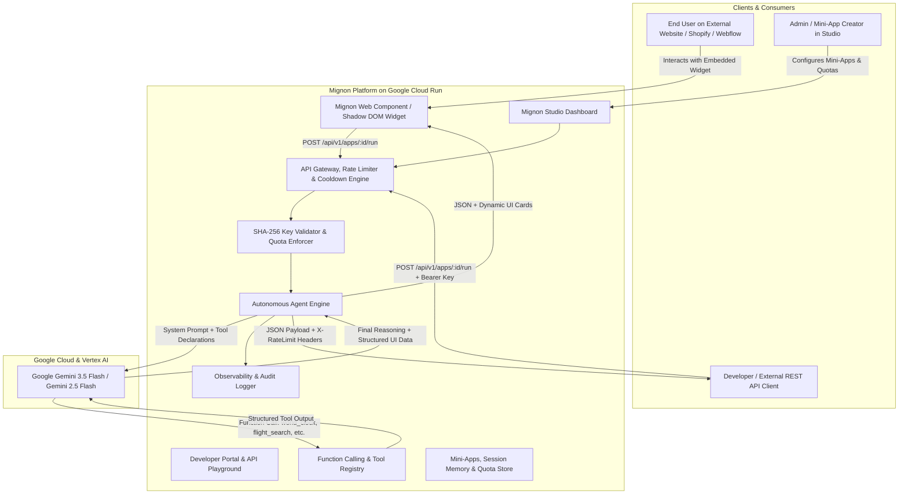

# 🚀 Mignon - Official Hackathon Submission Document

> **Project Name:** Mignon - Autonomous AI Mini-Apps & Agent Widget Engine  
> **Tagline:** Turn Gemini autonomous agents & tools into embeddable Mini-Apps and web widgets with 1 line of code.  
> **Target Tracks:** *The Taskmaster* (Autonomous action workflows & micro-tools) & *The Fortified Enterprise Fleet* (SHA-256 API Gateway, Rate Limiting & Real-time Telemetry)  
> **Core AI:** Google Gemini 3.5 Flash / Gemini 2.5 Flash with Native Function Calling  
> **Infrastructure:** Google Cloud Run (Serverless Containerized Engine)

---

## 📌 Project Links (For the Submission Form)

| Resource | Link / URL |
| :--- | :--- |
| **🌐 Live Deployment (Cloud Run)** | [https://mignon-platform-526192292529.us-central1.run.app/](https://mignon-platform-526192292529.us-central1.run.app/) |
| **✨ Interactive Widgets Showcase** | [https://mignon-platform-526192292529.us-central1.run.app/demo.html](https://mignon-platform-526192292529.us-central1.run.app/demo.html) |
| **💻 Code Repository (GitHub)** | [https://github.com/cesjavi/mignon](https://github.com/cesjavi/mignon) |
| **📊 Real-time Observability Dashboard** | [https://mignon-platform-526192292529.us-central1.run.app/analytics](https://mignon-platform-526192292529.us-central1.run.app/analytics) |
| **🎥 Video Demo / Pitch** | `[INSERT YOUTUBE / LOOM / VIMEO URL HERE]` *(2-3 min video)* |

---

## 💡 1. Executive Summary & Problem Statement (Elevator Pitch)

### The Problem
Traditional AI chatbots are **passive, text-heavy, and isolated**: users must continuously type open-ended prompts and manually parse through long walls of text. Furthermore, website owners and developers lack a friction-free way to embed specific agentic micro-capabilities directly into their websites (Webflow, WordPress, Shopify, Next.js, or plain HTML).

### Our Solution: Mignon
**Mignon** flips this paradigm by turning single-purpose autonomous AI agents into **reusable, embeddable Mini-Apps & Web Widgets**:
1. **Visual Studio & "Prompt-to-App" Co-Pilot:** Design autonomous mini-apps with system personas, structured parameters, and native Gemini tools in seconds.
2. **1-Line Embeddable Widget:** `<script src=".../widget.js" data-app-id="..."></script>` renders an isolated Shadow DOM component supporting forms, minimal quote cards, and voice synthesis (TTS).
3. **Enterprise REST API Gateway:** Secure Bearer authentication with **SHA-256** key hashing, copyable multi-language snippets (cURL, Python, JS, TypeScript), and live "Try-It" console.
4. **Anti-Spam, Burst Cooldown & Session Quotas:** Client-side debounce with visual countdowns (`⏳ Cooldown (3s)...`) and backend rate limiting with standard `X-RateLimit-*` headers to eliminate spam.
5. **Real-time Observability & Telemetry Dashboard:** Sub-second latency tracking, P95 metrics, Gemini token consumption, timeline charts, and function-calling audit trails.

---

## 🏗️ 2. System Architecture



---

## ⚡ 3. Key Features & Capabilities

### 🎯 Pre-configured Autonomous Mini-Apps with Native Function Calling
- **Flight Scout & Fare Radar:** Analyzes routes, finds real-time flights, calculates layovers, carbon footprint, and recommends optimal deals.
- **Global Time & Meeting Sync:** Computes worldwide local times across time zones, flags working hours, and identifies ideal meeting overlap slots.
- **Smart FX & Currency Radar:** Real-time exchange rate conversions paired with financial stability analysis.
- **AI Lead Qualifier & Concierge:** B2B lead qualifier scoring prospects and synthesizing next-step onboarding actions.
- **Linux Fortune & Quote of the Day:** Minimalist Unix philosophy & sysadmin humor generator with Cowsay ASCII art formatting.
- **Daily Senior Dev Tip:** Crisp 30-second architecture best practices and refactoring kata.

### 🛡️ Security, Anti-Spam Cooldown & Usage Quotas
- **Cryptographic SHA-256 Keys:** API keys are hashed and stored irreversibly with instant revocation capability.
- **Anti-Spam Burst Cooldown:** Blocks consecutive rapid clicks (returns HTTP 429 `COOLDOWN_ACTIVE`) with dynamic visual countdown timer on the button.
- **Per-Session / IP Quotas:** Enforces maximum free query caps per session with friendly user notifications.
- **API Gateway Rate Limiting:** Daily quotas per API key with standard RFC headers:
  - `X-RateLimit-Limit`
  - `X-RateLimit-Remaining`
  - `X-RateLimit-Reset`
  - `X-RateLimit-Cooldown`

### 📊 Real-time Observability & Telemetry Dashboard
- **Executive KPI Cards:** Total executions, success rate, average & P95 latency (ms), total Gemini tokens processed, and active agent fleet.
- **Timeline Activity Chart:** Interactive bar/area visualization tracking request volume, latency trends, and token usage over chronological buckets.
- **Channel Breakdown:** Ingestion distribution across Web Widgets, Developer REST API, and Studio Playground.
- **Execution Trace Inspector:** Deep audit stream with multi-filtering (Search, App, Channel, Status), click-to-inspect modal, and raw JSON copy.
- **Traffic Simulation:** Live *"Simulate Traffic"* trigger to generate realistic synthetic telemetry on demand.
- **Exporting:** One-click CSV and JSON data export.

---

## 🛠️ 4. Technology Stack

| Layer | Technologies |
| :--- | :--- |
| **Artificial Intelligence** | Google Gemini 3.5 Flash, Gemini 2.5 Flash, Native Function Calling, Multi-turn Memory |
| **Cloud & Infrastructure** | Google Cloud Run, Google Artifact Registry / GCR, Docker Containerization |
| **Backend & Engine** | Node.js (ESM), Express.js, Crypto (SHA-256), Webhook Dispatcher |
| **Frontend & Studio** | React 18, TypeScript, Tailwind CSS, Vite, Lucide Icons |
| **Embeddable Widget** | Vanilla JavaScript, Shadow DOM Web Components, Web Speech API (Voice & TTS) |

---

## 🏆 5. Alignment with Hackathon Judging Criteria

### 1. Innovation & Creativity
- Rather than building yet another open-ended chatbot, Mignon creates an **action-oriented micro-app layer** that transforms AI agents into modular, embeddable software components.
- Supports interactive forms, voice-guided inputs, and minimalist quote card displays.

### 2. Technical Execution & Architecture
- Robust Gemini Function Calling pipeline with deterministic tool execution and zero-friction fallback simulator.
- Strict **Shadow DOM encapsulation**, preventing CSS leaks into host websites (WordPress, Shopify, Webflow).
- Built-in anti-spam burst protection, session quotas, and RFC-compliant rate limit headers.

### 3. Google Cloud & Gemini Integration
- Leverages the lightning-fast latency, structured output capabilities, and expansive context window of **Gemini Flash**.
- Fully containerized and deployed on **Google Cloud Run** for serverless horizontal scalability.

### 4. User Experience & Developer Experience
- Copy-paste ready code snippets in 4 programming languages (cURL, Python, JS, TypeScript).
- Interactive *"Try-It"* playground console with live parameter execution.
- Real-time observability dashboard with sub-second trace inspection and CSV/JSON export.

---

## 📋 6. Form Copy-Paste Fields (For Submission)

### 🏷️ Basic Information:
- **Project Title:** `Mignon - Autonomous AI Mini-Apps & Agent Widget Engine`
- **Short Description / Subtitle:** `Turn Gemini autonomous agents & tools into embeddable Mini-Apps and web widgets with 1 line of code. Features SHA-256 API Gateways, real-time observability, and anti-spam quotas.`
- **Track:** `The Taskmaster` *(or "The Fortified Enterprise Fleet" / Multi-Track)*
- **GitHub Repository:** `https://github.com/cesjavi/mignon`
- **Live Demo URL:** `https://mignon-platform-526192292529.us-central1.run.app/`
- **Showcase Demo URL:** `https://mignon-platform-526192292529.us-central1.run.app/demo.html`
- **Built With:** `google-gemini`, `google-cloud-run`, `typescript`, `react`, `tailwind-css`, `node.js`, `docker`, `web-components`, `function-calling`

### 🔑 Environment Variables & Testing Instructions for Judges:
> Mignon includes a built-in **Autonomous Simulator Mode** allowing judges to test all tools and widgets out of the box with zero setup. To connect a custom Gemini API Key:
```env
GEMINI_API_KEY=your_google_gemini_api_key
PORT=4000
```

---

## 🎬 7. Recommended Video Demo Script (2-3 Minutes)

1. **0:00 - 0:30 (The Problem & Solution):** Highlight how traditional chatbots are passive and hard to integrate. Introduce **Mignon** and the concept of 1-line embeddable autonomous Mini-Apps.
2. **0:30 - 1:15 (Live Widgets Showcase):** Navigate to `demo.html` to showcase the live widgets (*Flight Scout*, *World Clock Sync*, *Currency Radar*) utilizing Gemini Function Calling, voice TTS, and anti-spam cooldown.
3. **1:15 - 1:45 (Mignon Studio & Prompt-to-App):** Walk through the visual editor, tool bindings, session quota controls, and the "Prompt-to-App" Gemini AI generator.
4. **1:45 - 2:15 (Developer API Gateway & Security):** Demonstrate SHA-256 API key creation, copyable multi-language code snippets, and the interactive Try-It console.
5. **2:15 - 2:45 (Observability & Telemetry Dashboard):** Tour the `/analytics` dashboard showing real-time timeline charts, latency distributions, the "Simulate Traffic" button, and execution trace inspection.
6. **2:45 - 3:00 (Conclusion & Google Cloud Run):** Conclude with the serverless deployment on Google Cloud Run and the future vision for Mignon.
