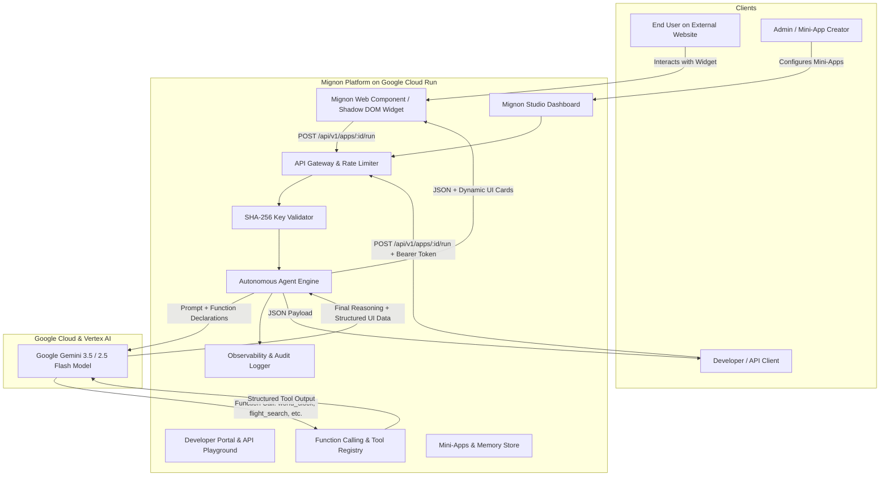

# Mignon - Autonomous AI Mini-Apps & Agent Widget Engine

> **Submitted to:** Google "All Things Agentic" Hackathon  
> **Track:** *The Taskmaster* (Autonomous action workflows) & *Fortified Enterprise Fleet* (Registry, SHA-256 API Gateways & Telemetry)  
> **Core AI:** Google Gemini 3.5 / 2.5 Flash via Google GenAI SDK & Tool Use  
> **Cloud Infrastructure:** Google Cloud Run (Containerized Microservice)

---

## 🌟 Overview & Problem Solved

Traditional AI chatbots are passive and text-only: users must continually prompt them and manually extract data. **Mignon** flips this paradigm by turning single-purpose AI agents into **reusable, embeddable Mini-Apps & Web Widgets**.

With Mignon, any developer, business, or website creator can:
1. **Design Mini-Apps visually:** Configure system personas, declare input parameters, and bind native Gemini tools (Flight searches, World time math, FX rates, Lead qualifiers).
2. **Embed anywhere with 1 line of code:** Drop `<script src=".../widget.js" data-app-id="..."></script>` into Webflow, WordPress, Shopify, Next.js, or plain HTML to give any site instant AI micro-powers.
3. **Execute via REST API:** Full developer portal with Bearer API Key security (hashed with SHA-256), copyable multi-language snippets (cURL, Python, JS, TypeScript), and interactive live "Try-It" console.
4. **Real-time Observability:** Built-in audit trail recording latency, token consumption, and autonomous tool invocation chains.

---

## 🏗️ System Architecture



---

## 🚀 Quick Start & Spin-Up Instructions

### Prerequisites
- Node.js 18+ or 20+
- npm or yarn

### 1. Run the Backend (API & Tool Engine)
```bash
cd backend
npm install
npm run dev
```
Backend starts at: `http://localhost:4000`

*(Optional)* Set your Gemini API key in `backend/.env`:
```env
GEMINI_API_KEY=your_google_gemini_api_key
PORT=4000
```
*Note: If no API key is provided, Mignon automatically runs in Autonomous Simulator Mode, executing tools and returning deterministic intelligent agent outputs for zero-friction local testing.*

### 2. Run the Frontend (Studio & Docs)
```bash
cd frontend
npm install
npm run dev
```
Mignon Studio opens at: `http://localhost:5173`

### 3. Test the Embeddable Demo Website
Open `http://localhost:5173/demo.html` in your browser to see external website embedding in action!

---

## ☁️ Google Cloud Run Deployment

To deploy Mignon to Google Cloud Run in minutes:

```bash
# 1. Build and push image to Google Artifact Registry / GCR
gcloud builds submit --tag gcr.io/[YOUR_PROJECT_ID]/mignon-agent-platform

# 2. Deploy to Cloud Run
gcloud run deploy mignon-agent-platform \
  --image gcr.io/[YOUR_PROJECT_ID]/mignon-agent-platform \
  --platform managed \
  --region us-central1 \
  --allow-unauthenticated \
  --set-env-vars GEMINI_API_KEY="your_api_key"
```

---

## 🏆 Hackathon Checklist Compliance

- [x] **Track:** The Taskmaster & Enterprise Fleet (Autonomous action, micro-tools, telemetry)
- [x] **Gemini Model:** Powered by Gemini 3.5 / 2.5 Flash with Function Calling / Tool Declarations
- [x] **Google Agent SDK / Framework:** Google GenAI Tool Architecture & Agent Runtime
- [x] **Google Cloud Infrastructure:** Containerized with Docker ready for Google Cloud Run
- [x] **Security & Zero-Trust:** API Keys secured with SHA-256 cryptographic hashing & revocation
- [x] **Developer Experience:** Complete Developer Portal with cURL, Python, JS snippets and Try-It console
- [x] **Embed Artifact:** Isolated Shadow DOM Web Component widget
