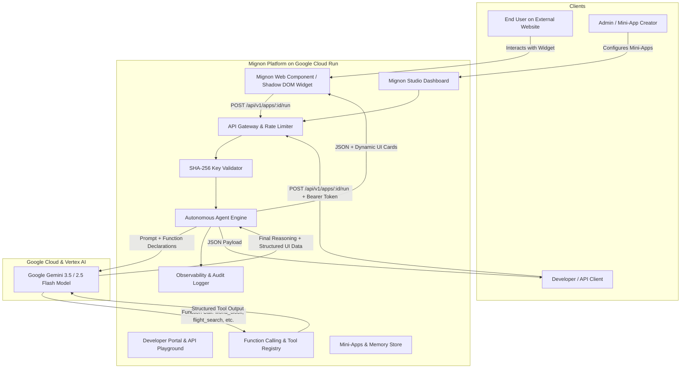

# Mignon - Autonomous AI Mini-Apps & Agent Widget Engine

[](https://mignon-platform-526192292529.us-central1.run.app/)
[](https://ai.google.dev/)
[](https://mignon-platform-526192292529.us-central1.run.app/demo.html)

> **Live Deployment URL:** [https://mignon-platform-526192292529.us-central1.run.app/](https://mignon-platform-526192292529.us-central1.run.app/)  
> **Interactive Widgets Showcase:** [https://mignon-platform-526192292529.us-central1.run.app/demo.html](https://mignon-platform-526192292529.us-central1.run.app/demo.html)  
> **GitHub Repository:** [https://github.com/cesjavi/mignon](https://github.com/cesjavi/mignon)  
> **Target Tracks:** *The Taskmaster* (Autonomous action workflows) & *The Fortified Enterprise Fleet* (Registry, SHA-256 Gateways & Telemetry)  
> **Core AI:** Google Gemini 3.5 Flash with Native Function Calling & Multi-turn Memory

---

## 🌟 Overview & Problem Solved

Traditional AI chatbots are passive and text-only: users must continually prompt them and manually extract data. **Mignon** flips this paradigm by turning single-purpose AI agents into **reusable, embeddable Mini-Apps & Web Widgets**.

With Mignon, any developer, business, or website creator can:
1. **Design Mini-Apps visually:** Configure system personas, declare input parameters, and bind native Gemini tools (Flight searches, World time math, FX rates, Lead qualifiers).
2. **Embed anywhere with 1 line of code:** Drop `<script src=".../widget.js" data-app-id="..."></script>` into Webflow, WordPress, Shopify, Next.js, or plain HTML to give any site instant AI micro-powers.
3. **Execute via REST API:** Full developer portal with Bearer API Key security (hashed with SHA-256), copyable multi-language snippets (cURL, Python, JS, TypeScript), and interactive live "Try-It" console.
4. **Real-time Observability:** Built-in audit trail recording latency, token consumption, and autonomous tool invocation chains.

---

## 🏗️ System Architecture



---

## 🚀 Quick Start & Spin-Up Instructions

### Prerequisites
- Node.js 18+ or 20+
- npm or yarn

### 1. Run the Backend (API & Tool Engine)
```bash
cd backend
npm install
npm run dev
```
Backend starts at: `http://localhost:4000`

*(Optional)* Set your Gemini API key in `backend/.env`:
```env
GEMINI_API_KEY=your_google_gemini_api_key
PORT=4000
```
*Note: If no API key is provided, Mignon automatically runs in Autonomous Simulator Mode, executing tools and returning deterministic intelligent agent outputs for zero-friction local testing.*

### 2. Run the Frontend (Studio & Docs)
```bash
cd frontend
npm install
npm run dev
```
Mignon Studio opens at: `http://localhost:5173`

### 3. Test the Embeddable Demo Website
Open `http://localhost:5173/demo.html` in your browser to see external website embedding in action!

---

## ☁️ Google Cloud Run Deployment

To deploy Mignon to Google Cloud Run in minutes:

```bash
# 1. Build and push image to Google Artifact Registry / GCR
gcloud builds submit --tag gcr.io/[YOUR_PROJECT_ID]/mignon-agent-platform

# 2. Deploy to Cloud Run
gcloud run deploy mignon-agent-platform \
  --image gcr.io/[YOUR_PROJECT_ID]/mignon-agent-platform \
  --platform managed \
  --region us-central1 \
  --allow-unauthenticated \
  --set-env-vars GEMINI_API_KEY="your_api_key"
```

---

---

## 🧪 Reproducible Testing & Evaluation Guide (For Judges & Evaluators)

Mignon is designed for 100% reproducible testing. Evaluators can test the system through the **live cloud deployment**, **direct API verification**, or **local spin-up**.

### 🌟 Option 1: Instant Zero-Setup Live Testing (Recommended)

No installation or API keys required — all endpoints, tools, and widgets are active 24/7 on Google Cloud Run:

1. **Test Autonomous Tool Calling & Mini-Apps:**
   - Navigate to [Live Studio](https://mignon-platform-526192292529.us-central1.run.app/)
   - Click **"Quick Test"** on *Flight Scout & Fare Radar* (executes Gemini flight search tools).
   - Click the **Speaker icon (🔊)** to test the Web Speech Voice Synthesis (TTS).
2. **Test 1-Line Embeddable Widgets & Anti-Spam Cooldown:**
   - Open the [Interactive Widgets Showcase](https://mignon-platform-526192292529.us-central1.run.app/demo.html).
   - Trigger the *Flight Scout* or *Global Meeting Sync* widget.
   - Click the submit button rapidly twice to observe the **3-second anti-spam cooldown protection** (`⏳ Cooldown (3s)...`).
3. **Test Real-Time Telemetry & Observability:**
   - Visit the [Observability Dashboard](https://mignon-platform-526192292529.us-central1.run.app/analytics).
   - Click **"Simulate Traffic"** to generate dynamic requests. Watch the timeline chart, $P_{95}$ latency distributions, and live Gemini token counters update in real-time.
   - Click any row in the **Audit Stream** to inspect the raw JSON execution traces.
4. **Test "Prompt-to-App" AI Generator:**
   - In the Studio, click **"Prompt-to-App (Create with AI)"**.
   - Enter a prompt (e.g., *"A crypto gas fee estimator agent"*) and watch Gemini generate the structured JSON schema and tool bindings.

---

### 💻 Option 2: Automated API Verification (cURL / Terminal)

You can verify the backend API, Gemini function calling, and rate-limiting directly via terminal:

#### 1. Verify Health & Agent Engine Status
```bash
curl -X GET "https://mignon-platform-526192292529.us-central1.run.app/health"
```
*Expected Output:* `{"status":"healthy","service":"Mignon Agent Engine","engine":"Gemini 2.5 Flash / 3.5 Flash",...}`

#### 2. Execute an Autonomous Mini-App (Flight Scout with Tool Execution)
```bash
curl -X POST "https://mignon-platform-526192292529.us-central1.run.app/api/v1/apps/app_flight_scout/run" \
  -H "Content-Type: application/json" \
  -d '{"inputs":{"origin":"Buenos Aires (EZE)","destination":"Madrid (MAD)"}}'
```

#### 3. Test Anti-Spam Burst Cooldown (HTTP 429)
Execute the previous request twice within 3 seconds:
*Expected Output:* `HTTP 429 Too Many Requests` with payload `{"error":"COOLDOWN_ACTIVE","message":"Anti-spam burst limit active. Please wait..."}`

#### 4. Test SHA-256 API Key Creation & Quotas
```bash
curl -X POST "https://mignon-platform-526192292529.us-central1.run.app/api/v1/keys" \
  -H "Content-Type: application/json" \
  -d '{"name":"Evaluator Key","rateLimit":50}'
```

---

### 🐳 Option 3: Local Containerized Spin-Up (Docker)

To run the entire unified stack locally in a single container:

```bash
# 1. Clone repository
git clone https://github.com/cesjavi/mignon.git
cd mignon

# 2. Build Docker container
docker build -t mignon-app .

# 3. Run container locally
docker run -p 8080:8080 -e GEMINI_API_KEY="your_api_key_or_leave_blank_for_simulator" mignon-app
```
*Access the local instance at:* `http://localhost:8080`

---

## 🏆 Hackathon Checklist Compliance

- [x] **Track:** The Taskmaster & Enterprise Fleet (Autonomous action, micro-tools, telemetry)
- [x] **Gemini Model:** Powered by Gemini 3.5 / 2.5 Flash with Function Calling / Tool Declarations
- [x] **Google Agent SDK / Framework:** Google GenAI Tool Architecture & Agent Runtime
- [x] **Google Cloud Infrastructure:** Containerized with Docker ready for Google Cloud Run
- [x] **Security & Zero-Trust:** API Keys secured with SHA-256 cryptographic hashing & revocation
- [x] **Developer Experience:** Complete Developer Portal with cURL, Python, JS snippets and Try-It console
- [x] **Embed Artifact:** Isolated Shadow DOM Web Component widget
- [x] **Reproducible Testing:** Complete step-by-step verification guide with live URLs and cURL commands

